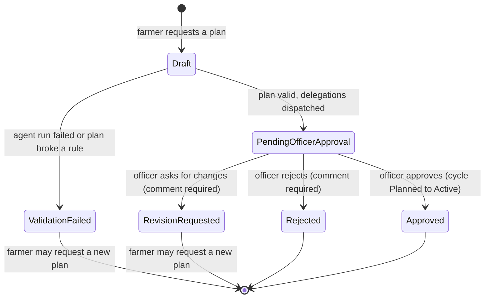

# Cultivation Planning Agent

Component 1's agent, and the workflow coordinator for the whole platform. It turns a farmer's
objective into a stage-by-stage cultivation plan for one cycle, and delegates everything
outside its authority — quantities, protection schedules, final validation — to the other
components' agents. It does **not** decide fertiliser dosages, pesticide products or resource
quantities — those belong to the Resource Analysis and Pest & Disease agents, and the
validator enforces it.

## Input / output

**Input** — `PlanAgentInput`: `cycleId`, plus the farmer's `objective` in their own words. The
objective is untrusted data: it reaches the model inside a `<farmer_objective>` block in the
*user* prompt, never the system prompt, and any attempt to close that block early is
neutralised.

**Output** — `CultivationPlanOutput`, stored verbatim in `CultivationPlan.PlanJson`, so its
property names are the API's contract too:

| Field | Shape |
| --- | --- |
| `summary` | Two or three sentences for the farmer. |
| `steps[]` | `stage`, `windowStart`, `windowEnd` (`YYYY-MM-DD`), `task`, `rationale`, `category`. |
| `delegations[]` | `targetAgent`, `instruction`, `payload` (opaque object). |
| `assumptions[]` | Everything filled in because the data did not say it. |

`stage` is a `GrowthStage`: Nursery, Tillering, PanicleInitiation, Flowering, GrainFilling,
Harvest. `category` is one of LandPrep, Water, Nutrient, Protection, Monitoring, Harvest.
`targetAgent` is one of ResourceAnalysisAgent, PestDiseaseDiagnosisAgent,
SchedulingValidationAgent. The JSON Schema in `CultivationPlanJson.JsonSchema` is embedded in
the system prompt, so the model returns something the service can deserialise.

## Tools and their permissions

**Every tool is read-only** — `AsNoTracking` queries, no writes, ever — and **scoped to the
cycle the run was started for**. A `cycleId` argument that is not the run's cycle is refused
with `"Only cycle N can be read during this run."`, so an objective crafted to steer the model
at another farmer's data gets nothing back.

| Tool | Returns | Scoping |
| --- | --- | --- |
| `get_cycle` | The cycle with its field, division and variety; `today` and `expectedStageToday`. | Run's cycle only. |
| `get_stage_timeline` | The six stage windows, from the cycle's *stored* sowing and harvest dates. | Run's cycle only. |
| `get_variety` | Name, duration, age group, notes. | Unscoped — varieties are public reference data. |
| `get_previous_cycles` | The last three earlier cycles on the field, with their stage logs. | Only the run cycle's own field. |

`get_cycle` and `get_stage_timeline` are mandatory before the model answers.

## Error handling

- **Provider failure** (`LlmException`, including 429) — never retried silently. The run is
  logged as failed and the plan becomes `ValidationFailed` with a farmer-readable message.
- **Unparseable reply** — the raw text is kept in `AgentRunLog.RawOutput` and `Error` so a bad
  parse can be diagnosed; the run is a failure, not a crashed request.
- **Unknown tool or bad tool arguments** — returned to the model as `{"error": "..."}` so it
  can recover within the same run.
- **Delegation failure** — logged as its own failed `AgentRunLog` row. It does **not** change
  the plan's status: the plan itself passed validation, so it still belongs in the queue.
- Every run, successful or not, writes an `AgentRunLog` row under one correlation id.

## Validation rules

`CultivationPlanValidator.Validate` is plain deterministic code — no database, no LLM — so a
plan is judged the same way every time and the failures are shown to the farmer verbatim. It
collects *all* failures rather than stopping at the first.

1. At least one step, and a non-empty summary.
2. Every `step.stage` parses to a `GrowthStage`.
3. Every `step.category` is one of the six `PlanStepCategories`.
4. `windowStart <= windowEnd` on every step.
5. Every step's window lies inside the timeline window for its own stage, **±3 days** — the
   stage boundaries come from fractions of the season, so a couple of days either side is an
   agronomic judgement call, not a mistake.
6. Every window lies inside `[sowingDate, expectedHarvestDate]`.
7. No step's `windowEnd` is before `requestedOn` — "step is in the past".
8. Steps are ordered non-decreasing by `windowStart`.
9. Every delegation targets one of the three `AgentNames` constants and carries a non-empty
   instruction.
10. No step's `task` text matches
    `\d+(\.\d+)?\s?(kg|g|ml|l|litre|liter|bag|bags)\b|\d+(\.\d+)?\s?%`
    (case-insensitive) — a quantity in a task is a **dosage decision out of scope**.

The validator runs with `requestedOn` = today (UTC). Invalid → `ValidationFailed` and the
errors are stored in `ValidationErrorsJson`. Valid → `PendingOfficerApproval`, and each
delegation is mapped onto the shared `DelegatedTask` (`TaskType` = the instruction,
`PayloadJson` = the serialised payload) and dispatched to the keyed agent it names.

## Workflow states

A cycle may hold only one plan that is `PendingOfficerApproval` or `Approved` at a time, so a
plan already with an officer is never replaced behind their back. Approval is one database
transaction: the plan becomes `Approved` and the cycle moves `Planned` to `Active` together,
or neither does.

## Endpoints

| Method | Route | Role |
| --- | --- | --- |
| POST | `/api/cycles/{cycleId}/plans` | Farmer |
| GET | `/api/cycles/{cycleId}/plans` | Any (farmer sees only their own) |
| GET | `/api/plans/{id}` | Any (farmer sees only their own) |
| GET | `/api/plans/pending?divisionId=` | AgriculturalOfficer |
| POST | `/api/plans/{id}/review` | AgriculturalOfficer |
